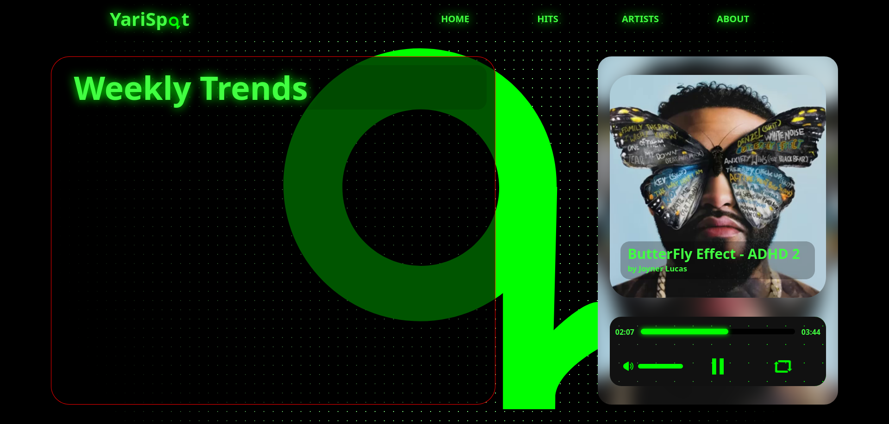

<div align="center">


<br/>


</div>

---

## 🎧 About the Project

<p align="center">
A stylish replacement for default HTML5 audio controls,  
crafted for developers who want <b>full design freedom</b> and <b>smooth UX</b>.
</p>

---

## ✨ Features

<div align="center">

🎛️ Custom Controls • 🎨 Modern UI • ⚡ Lightweight  
📱 Responsive • 🔧 Easy to Extend

</div>

---

## 🚀 Live Demo
<frame src="index.html"></frame>

---

## 📸 Preview

<p align="center">

</p>

---

## 🧩 Project Structure

```bash
Custom-HTML5-Audio-Controls
├── index.html
├── css/style.css
├── js/script.js
└── assets/audio
